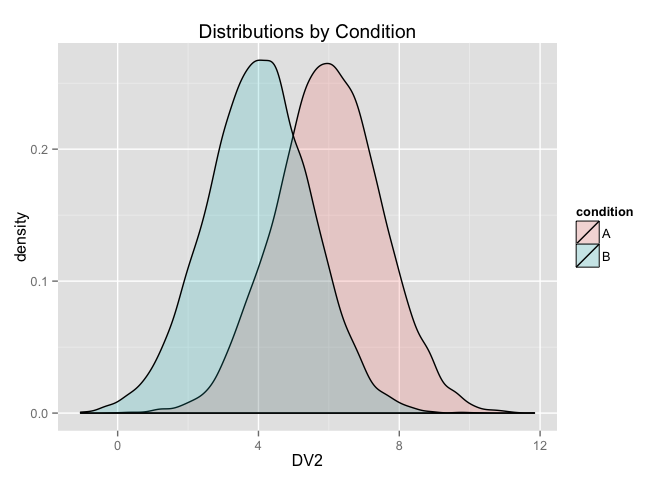

# Analyzing and plotting across multiple Dependent Measures
Nick Michalak  
June 29, 2015  
##Make fake data and save it to your directory/folder that's also your GitHub repository

```r
setwd("~/")
setwd("Google Drive/The Data Scientist’s Toolbox/test-repo/")
#ignore this because this is my GitHub repo that's on GitHub and on my computer
condition <- c(rep("A",1000),rep("B",1000)) #make condition factor
dv1 <- c(rnorm(1000,4,1.5),rnorm(1000,6,1.5)) #make one dv
dv2 <- c(rnorm(1000,6,1.5),rnorm(1000,4,1.5)) #and another
fakedata <- data.frame(condition,dv1,dv2) #combine above into a dataframe
write.table(fakedata,"fakedata.csv",sep=",",row.names = FALSE,col.names = TRUE) #save as a csv
```

> ###get a GitHub [(https://github.com)](https://github.com/) account, dude.

##Load data from your GitHub repository (badass, I know)

```r
fakedata.url <- url("https://raw.githubusercontent.com/nmmichalak/test-repo/master/fakedata.csv")
#make the url an object with the url function (make sure it's raw on GitHub)
fakedata <- read.csv(fakedata.url,sep=",",header = TRUE)
#load it like any other csv
head(fakedata) #see what it looks like
```

```
##   condition      dv1      dv2
## 1         A 5.117141 8.769191
## 2         A 5.099753 4.116358
## 3         A 2.317778 3.562209
## 4         A 3.258917 7.633193
## 5         A 3.586308 7.009617
## 6         A 3.240490 8.589465
```

##Plot code
* ### using sapply to apply plot code (any code, really) over a list of variable names in my fake dataset


```r
library(ggplot2) #duh
densities <- sapply(c("dv1","dv2"),function(i) {
  ggplot(data=fakedata,aes_string(x=i,fill="condition")) +
    geom_density(aes_string(x=i,fill="condition"),alpha=.2) +
    labs(x=paste(toupper(i)),color="Condition",title="Distributions by Condition")
#sapply plot function over list of variables names in the dataset
},
simplify = FALSE,USE.NAMES = TRUE)
#simplify returns output as list, USE.NAMES (only in sapply) names the objects in the list (nice for calling
#them later)
plots <- sapply(c("dv1","dv2"),function(i) {
  ggplot(data=fakedata,aes_string(x="condition",y=i,fill="condition")) +
  stat_summary(fun.data="mean_cl_boot",aes_string(x="condition",y=i),geom="bar") +
  stat_summary(fun.data="mean_cl_boot",aes_string(x="condition",y=i),geom="errorbar",width=.2) +
  labs(x=NULL,y=paste(toupper(i)),fill="Condition",title="95% CIs")
},
simplify = FALSE,USE.NAMES = TRUE)
anovas <- sapply(c("dv1","dv2"),function(i) {
  formula <- paste0(i,"~condition")
#for some reason you need to paste the text for the formula argument here
  anova(lm(formula,fakedata))
},
simplify = FALSE,USE.NAMES = TRUE)
library(dplyr)
```

```
## 
## Attaching package: 'dplyr'
## 
## The following object is masked from 'package:stats':
## 
##     filter
## 
## The following objects are masked from 'package:base':
## 
##     intersect, setdiff, setequal, union
```

```r
fakedata <- tbl_df(fakedata)
descriptives <- sapply(c("dv1","dv2"),function(i) {
  fakedata %>% group_by(.,condition) %>% summarise(.,n=n(),
                                                   M=mean(i),
                                                   SD=sd(i))
},
simplify = FALSE,USE.NAMES = TRUE)
```

```
## Warning in mean.default("dv1"): argument is not numeric or logical:
## returning NA
```

```
## Warning in mean.default("dv1"): argument is not numeric or logical:
## returning NA
```

```
## Warning in var(if (is.vector(x)) x else as.double(x), na.rm = na.rm): NAs
## introduced by coercion
```

```
## Warning in var(if (is.vector(x)) x else as.double(x), na.rm = na.rm): NAs
## introduced by coercion
```

```
## Warning in mean.default("dv2"): argument is not numeric or logical:
## returning NA
```

```
## Warning in mean.default("dv2"): argument is not numeric or logical:
## returning NA
```

```
## Warning in var(if (is.vector(x)) x else as.double(x), na.rm = na.rm): NAs
## introduced by coercion
```

```
## Warning in var(if (is.vector(x)) x else as.double(x), na.rm = na.rm): NAs
## introduced by coercion
```

###DV 1: Density Plots (read: fancy histograms)

```r
densities[["dv1"]]
```

 

###DV1: Mean Plots with 95%CIs

```r
library(knitr)
kable(descriptives[["dv1"]],format = "pandoc")
```


condition      n  M    SD 
----------  ----  ---  ---
A            100  NA   NA 
B            100  NA   NA 

```r
plots[["dv1"]]
```

 

###DV1: ANOVA

```r
options(digits=3)
kable(anovas[["dv1"]],format="pandoc")
```

              Df   Sum Sq   Mean Sq   F value   Pr(>F)
----------  ----  -------  --------  --------  -------
condition      1      270     270.0       123        0
Residuals    198      436       2.2        NA       NA

###DV 2: Density Plots (read: fancy histograms)

```r
densities[["dv2"]]
```

 

###DV 2: Mean Plots with 95%CIs

```r
kable(descriptives[["dv2"]],format = "pandoc")
```


condition      n  M    SD 
----------  ----  ---  ---
A            100  NA   NA 
B            100  NA   NA 

```r
plots[["dv2"]]
```

 

###DV 2: ANOVA

```r
options(digits=3)
kable(anovas[["dv2"]],format="pandoc")
```

              Df   Sum Sq   Mean Sq   F value   Pr(>F)
----------  ----  -------  --------  --------  -------
condition      1      242    242.22      89.4        0
Residuals    198      536      2.71        NA       NA
